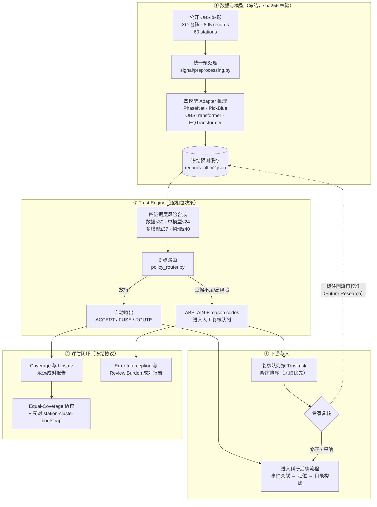
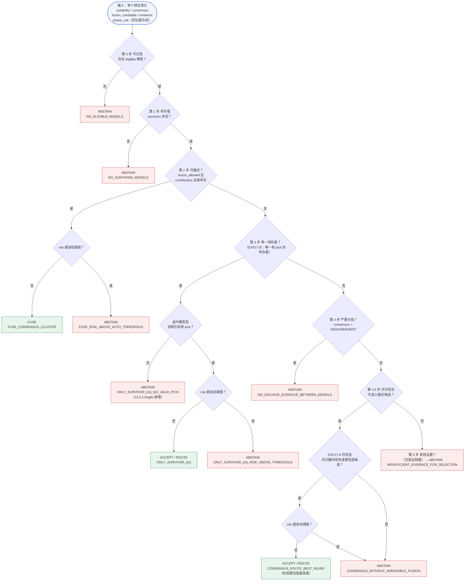
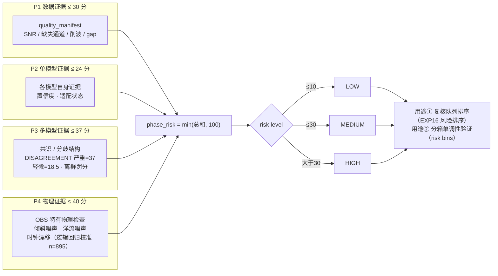
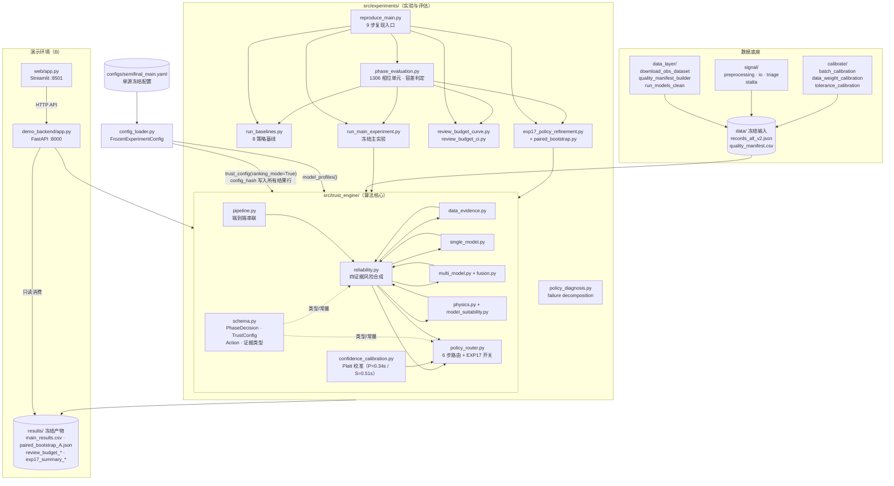
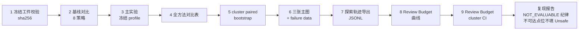
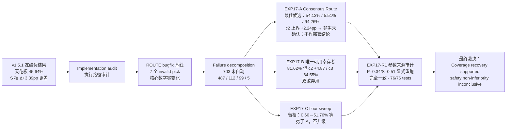
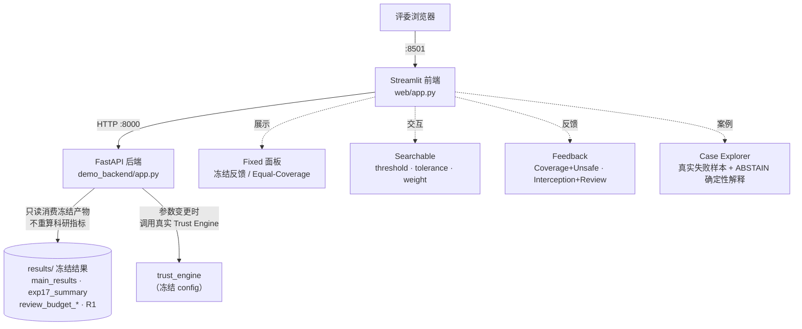
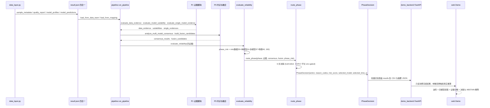
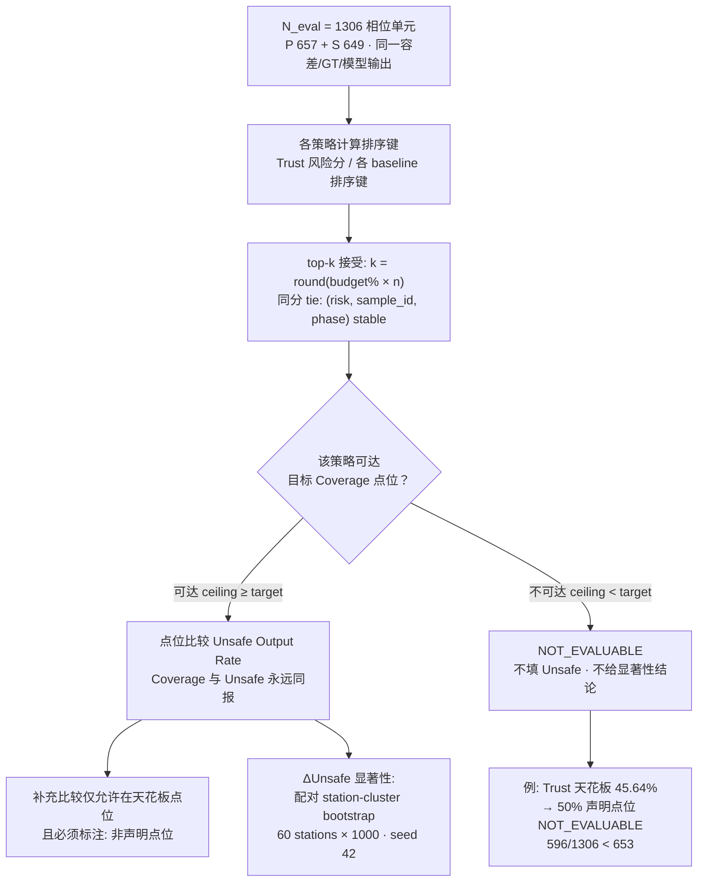
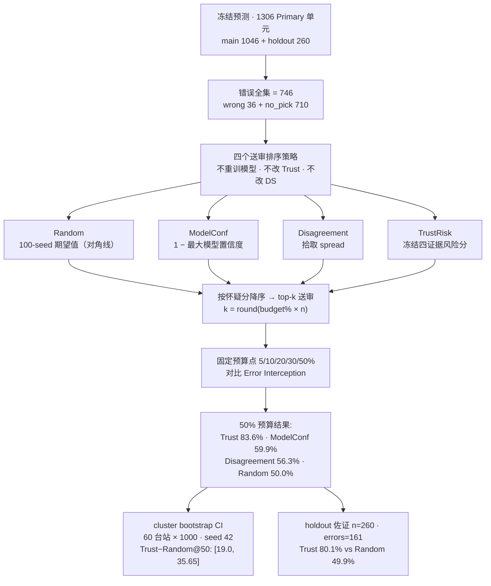

# OBS Trust Layer — 系统架构与流程图示

> 本文件所有模块名、步骤名、reason code、参数取值均与仓库代码一致
> (config `semifinal_v1.5.1-bugfix` / `9727570d…`，冻结于 EXP17 最终裁决)。
> GitHub 可直接渲染 Mermaid；导出 PNG 用于答辩见文末说明。

---

## 图 1 · 系统业务流程图（端到端科研工作流）

---

## 图 2 · Trust Engine 决策流程图（核心算法，6+1 步路由）

> 口径说明：正式实验以 `ranking_mode` 运行（automatic_risk_threshold 由 10 覆盖为
> 100），即 risk 分只用于排序、不直接拦截；自动放行的门禁是第 0–4.5 步的
> **证据准入**（truth-blind，规则只读推理时可见证据，绝不读 evaluation truth）。

---

## 图 3 · 四证据层结构（风险合成）

---

## 图 4 · 模块结构及上层调用关系图

---

## 图 5 · 复现链（reproduce_main 九步 + 复现报告）

---

## 图 6 · 开放探索闭环（Hypothesis → … → Limitation）

---

## 图 7 · Demo 部署结构（B · Docker Compose）

---

## 图 8 · 单样本决策时序图（一次决策经过哪些模块）

---

## 图 9 · Equal-Coverage 协议图（公平比较与 NOT_EVALUABLE 纪律）

---

## 图 10 · Review Budget 实验设计图（EXP16 四策略对比）

---

## 补充建议（按答辩价值排序）

1. ✅ **单样本决策时序图** — 见上图 8。
2. ✅ **Equal-Coverage 协议图** — 见上图 9。
3. ✅ **Reason Code → 解释模板对应表** — 已写入 [schema_contract.md §13](schema_contract.md)（A 提供、B 复制）。
4. ✅ **Review Budget 实验设计图** — 见上图 10。
5. **PNG 导出**：Mermaid 源已可渲染；图片版在 `docs/figures/`（由
   `@mermaid-js/mermaid-cli` 批量导出，10/10 语法校验通过）。答辩最值得入片：
   图 1 / 2 / 4 / 6 / 8 / 9。

   | 文件 | 内容 |
   |------|------|
   | 01_business_flow.png | 系统业务流程图 |
   | 02_router_decision.png | 6 步路由决策流程图 |
   | 03_evidence_layers.png | 四证据层风险合成 |
   | 04_module_callgraph.png | 模块结构及调用关系 |
   | 05_reproduction_chain.png | reproduce_main 九步复现链 |
   | 06_exploration_loop.png | 开放探索闭环 |
   | 07_demo_deploy.png | Demo 部署结构 |
   | 08_decision_sequence.png | 单样本决策时序图 |
   | 09_equal_coverage.png | Equal-Coverage 协议图 |
   | 10_review_budget.png | Review Budget 实验设计图 |

> 图 2 的 reason code 与 `src/trust_engine/policy_router.py` 逐字一致；
> 图 3 的权重与 `configs/semifinal_main.yaml`（data 30 / single 24 / multi 37 /
> physics 40）及 `reliability.py` 的合成公式一致；图 6/9/10 的数字全部来自
> `results/` 冻结产物。
